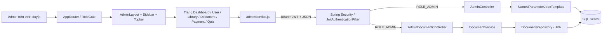
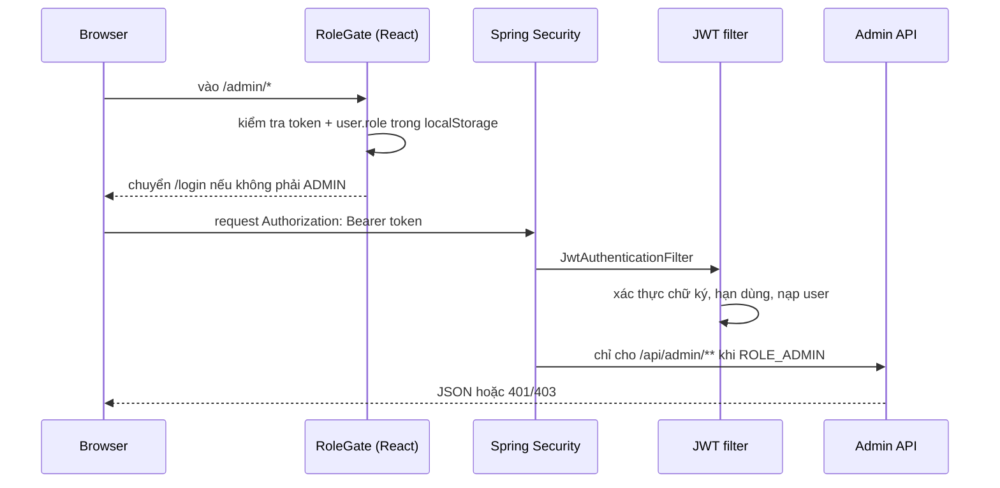
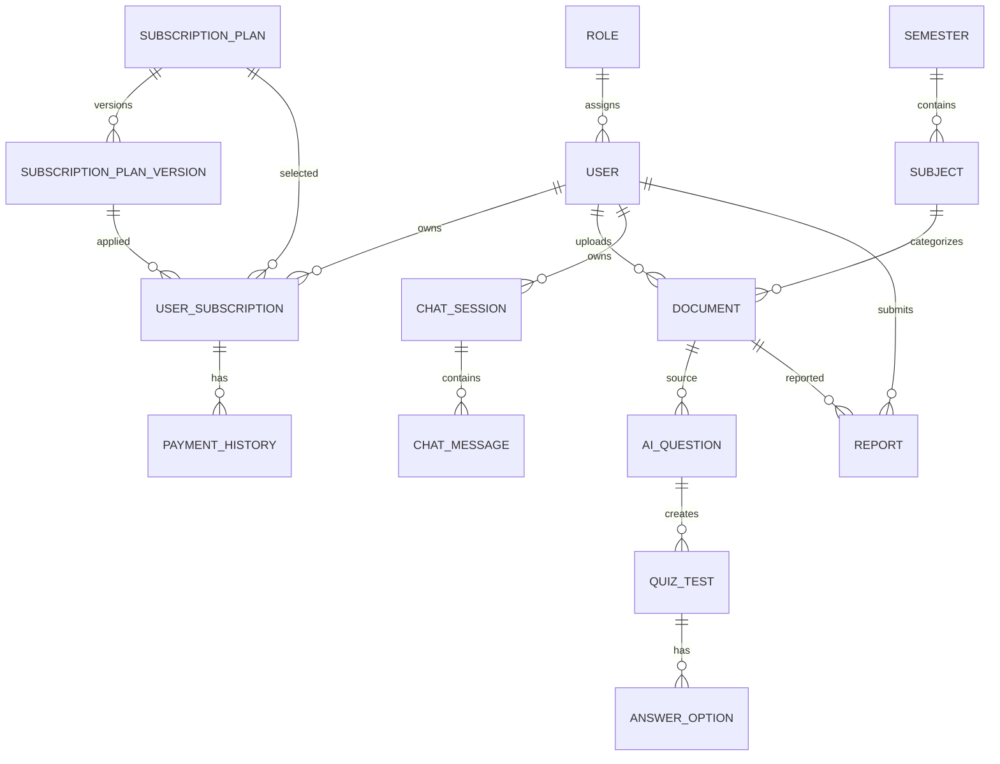

# AI Study Hub — Tài liệu học Module Admin

> Mục tiêu: dùng để hiểu, trình bày và trả lời bảo vệ đồ án. Tài liệu phản ánh mã nguồn tại thời điểm đọc, không suy diễn những endpoint chưa có backend.

## Mục lục

1. [Phạm vi và kiến trúc](#1-phạm-vi-và-kiến-trúc)
2. [Luồng dữ liệu và API](#2-luồng-dữ-liệu-và-api)
3. [Hồ sơ từng file](#3-hồ-sơ-từng-file)
4. [Cơ sở dữ liệu](#4-cơ-sở-dữ-liệu)
5. [Rủi ro, lỗi thường gặp và cải tiến](#5-rủi-ro-lỗi-thường-gặp-và-cải-tiến)
6. [30 câu hỏi hội đồng](#6-30-câu-hỏi-hội-đồng)
7. [Mock interview](#7-mock-interview)

## 1. Phạm vi và kiến trúc

### Phạm vi đã đọc

Các file trực tiếp tạo chức năng Admin gồm 18 file React (`pages/admin`, `components/admin`, `layout/Admin*`, `adminService.js`, `adminMock.js`), các route/gate liên quan, và 10 file Java/SQL phụ trách API, bảo mật, DTO, entity, repository. Các service như `DocumentService` được đưa vào vì `AdminDocumentController` gọi trực tiếp.

### Sơ đồ kiến trúc Admin



**Điểm bảo vệ quan trọng:** kiến trúc không thuần MVC. `AdminDocumentController → DocumentService → DocumentRepository` là MVC/JPA; nhưng đa số `AdminController → NamedParameterJdbcTemplate → SQL Server` đi thẳng, không có lớp Service/Repository riêng. Đây là thiết kế hiện có, không nên nói là tất cả API đều qua Service.

### Cơ chế quyền hai lớp



RoleGate cải thiện trải nghiệm và ngăn truy cập giao diện, nhưng **không phải bảo mật cuối cùng** vì localStorage có thể bị sửa. `SecurityConfig` mới là lớp quyết định an toàn.

## 2. Luồng dữ liệu và API

### Luồng chuẩn

```text
Người quản trị bấm nút
↓
React page cập nhật state / gọi adminService
↓
request() thêm Content-Type và JWT trong Authorization
↓
Spring Security + JwtAuthenticationFilter xác thực JWT
↓
SecurityConfig yêu cầu ROLE_ADMIN cho /api/admin/**
↓
Controller validate tối thiểu, chạy SQL/JPA
↓
SQL Server trả dữ liệu
↓
Controller/DTO định dạng JSON
↓
adminService parse JSON hoặc ném Error
↓
React cập nhật giao diện / báo lỗi
```

### Danh sách endpoint thực sự có trong `AdminController`

| Method | Endpoint | Chức năng |
|---|---|---|
| GET | `/api/admin/dashboard` | Tổng hợp KPI, phân bố plan, tài liệu/chat gần đây |
| GET | `/api/admin/conversations` | Tối đa 200 phiên chat |
| GET | `/api/admin/conversations/{sessionId}` | Chi tiết phiên chat, chỉ đọc |
| GET/POST | `/api/admin/users` | Tìm/lấy hoặc tạo user |
| PUT/DELETE | `/api/admin/users/{id}` | Cập nhật/xóa user cùng dữ liệu phụ thuộc |
| GET/POST | `/api/admin/library/semesters` | Danh sách/tạo học kỳ |
| PUT/DELETE | `/api/admin/library/semesters/{id}` | Sửa/xóa học kỳ và cây dữ liệu liên quan |
| GET/POST | `/api/admin/library/semesters/{id}/courses` | Lấy/tạo môn học |
| GET/PUT/DELETE | `/api/admin/library/courses/{id}` | Xem/sửa/xóa môn (GET không có; danh sách ở endpoint semester) |
| GET | `/api/admin/library/courses/{id}/documents` | Tài liệu trong môn |
| GET | `/api/admin/document-management` | Danh sách tài liệu để quản trị |
| PUT/DELETE | `/api/admin/document-management/{id}` | Đổi trạng thái hoặc xóa tài liệu |
| GET | `/api/admin/payments` | Tổng quan thanh toán |
| PUT | `/api/admin/payments/plans/{plan}` | Cập nhật giá plan theo backend hiện tại |
| GET/DELETE | `/api/admin/practice-tests/{id}` | Chi tiết câu hỏi / xóa một AI question |
| GET | `/api/admin/practice-tests` | Danh sách practice test |
| PUT | `/api/admin/practice-tests/{testId}/questions/{quizId}` | Sửa câu hỏi và đáp án |
| GET | `/api/admin/practice-review-queue` | Hàng đợi report |
| PUT | `/api/admin/practice-review-queue/{id}` | Sửa report |
| PUT | `/api/admin/practice-review-queue/{id}/resolve` | Đóng report |
| GET | `/api/admin/documents/pending` | Hàng đợi duyệt document theo JPA |
| POST | `/api/admin/documents/{id}/approve` | Public document đang chờ |
| POST | `/api/admin/documents/{id}/reject` | Đưa document chờ duyệt về Private |

### Chênh lệch Frontend–Backend cần nói thẳng

`adminService.js` còn khai báo AI config, storage, notification, plans/version/subscriber. Các API này có controller riêng hoặc chưa khớp route/method với `AdminController`; ví dụ service gọi `POST /api/admin/plans` trong khi controller hiện có `PUT /api/admin/payments/plans/{plan}`. `getReviewQueue()` trả mảng rỗng bằng `Promise.resolve([])`. Đây là dấu hiệu một phần UI/mock đang đi trước backend và là backlog, không được mô tả là đã hoàn thiện end-to-end.

## 3. Hồ sơ từng file

### A. Frontend: nền tảng và giao diện chung

#### `frontend/src/routes/AppRouter.jsx`

**1. Thông tin file.** Vai trò: bảng định tuyến SPA và chặn route theo vai trò. Liên kết `AdminLayout`, 9 trang Admin, `react-router-dom`, localStorage.

**2. Mục đích.** Chỉ ADMIN có token mới đi được vào `/admin/*`; đồng thời tải chậm (lazy loading) các trang để gói JavaScript ban đầu nhẹ hơn.

**3. Luồng.** URL `/admin/users` → `RoleGate` → kiểm tra `token`/`user.role` → `AdminLayout` → `AdminUserManagementPage`. Không gọi database ở file này.

**4. Hàm.** `normalizeRole(role)`: chuẩn hóa `ROLE_ADMIN` thành `ADMIN`; input role, output string; trim/in hoa/bỏ tiền tố; thiếu role trả chuỗi rỗng, bỏ nó dễ sai so sánh quyền. `getCurrentAuthUser()`: parse `localStorage.user`, lỗi JSON trả `null`; bỏ sẽ dễ làm app crash. `RoleGate({allow,fallback,children})`: quyết định render hay redirect; input quyền và component; nếu thiếu token/user về login, sai role về fallback; bỏ hàm là lộ giao diện quản trị. `AppRouter()`: khai báo route tree; `RouteLoading`: fallback khi import động.

**5. Block quan trọng.** `lazy` + `Suspense` là tối ưu tải; `Navigate replace` tránh nút Back quay lại trang cấm. Kiểm tra FE chỉ là UX, quyền thật vẫn ở backend.

**6. Hỏi hội đồng.** *Tại sao cần RoleGate khi backend đã kiểm quyền?* — “Để người dùng không thấy UI không phù hợp và giảm request vô ích; backend vẫn là nguồn tin cậy vì client có thể bị sửa.”

**7. Kiến thức.** SPA routing, RBAC, lazy loading, client-side state. **8. Học thuộc.** Router ánh xạ URL sang page, RoleGate kiểm tra token và role, AdminLayout là khung chung, backend vẫn xác thực độc lập. **9. Flashcards.** Q1 RoleGate làm gì? A Chặn UI theo role. Q2 `replace`? A Không lưu route cấm vào history. Q3 `lazy`? A Tải page khi cần. Q4 Token thiếu? A Về login. Q5 Sai role? A Về fallback. Q6 Role chuẩn hóa? A Tránh lệch `ROLE_`. Q7 Router gọi DB? A Không. Q8 Security thật ở đâu? A Spring Security. Q9 Outlet ở đâu? A Layout. Q10 Lợi ích route tree? A Dễ tổ chức. **10. Độ khó:** ⭐⭐; học kỹ khác biệt FE guard/backend guard.

#### `frontend/src/components/layout/AdminLayout.jsx`

**1. Thông tin.** Khung Admin, liên kết `useSidebar`, `AdminSidebar`, `AdminTopbar`, `Outlet`. **2. Mục đích.** Giữ sidebar/topbar ổn định, chỉ thay phần nội dung trang.

**3. Luồng.** Router render layout → hook trả `{collapsed,toggle}` → Context chia state → `Outlet` hiển thị trang con. Không có API/DB.

**4. Hàm `AdminLayout()`.** Input không có; output JSX shell. Tạo SidebarContext, tính chiều rộng 60/234px, render component con. Bỏ nó mỗi page phải tự dựng menu/topbar và route con không có chỗ render.

**5. Block.** `SidebarContext.Provider` là dependency sharing; CSS variable `--sidebar-w` và transition tạo hiệu ứng thu gọn.

**6. Hỏi.** *Vì sao dùng Outlet?* — “Để layout tái sử dụng: sidebar/topbar không bị mount lại khi đổi màn hình.” **7. Kiến thức:** nested routing, Context API. **8. Học thuộc:** Layout là container, Context quản lý sidebar, Outlet là vị trí trang Admin con. **9. Flashcards:** Q1 Outlet? A Chỗ render child route. Q2 Context? A Chia sẻ state. Q3 Width collapsed? A 60px. Q4 Width mở? A 234px. Q5 Gọi API? A Không. Q6 Lợi ích? A Tái sử dụng. Q7 Topbar? A Thành phần dùng chung. Q8 Sidebar? A Điều hướng. Q9 overflow-y? A Cuộn nội dung. Q10 Bỏ layout? A Lặp UI. **10. Độ khó:** ⭐.

#### `frontend/src/components/layout/AdminSidebar.jsx`

**1. Thông tin.** Menu điều hướng; liên kết `NavLink`, `useLocation`, `useSidebarContext`, logo và các route `/admin/*`. **2. Mục đích.** Cung cấp navigation và chế độ thu gọn.

**3. Luồng.** URL hiện tại → `useLocation` → so slug menu → `NavLink` active → người dùng click chuyển route. **4. Hàm `AdminSidebar()`:** lấy `collapsed/toggle` từ Context và location, lặp `NAV_ITEMS`, render logo/menu/nút thu gọn; không input/output dữ liệu nghiệp vụ; bỏ file làm mất điều hướng. `NAV_ITEMS` là cấu hình, không phải API.

**5. Block.** `NavLink` dùng trạng thái route cho active style; `NAV_ITEMS` tách data menu khỏi JSX. **6. Hỏi.** *Vì sao không hard-code từng link?* — “Mảng cấu hình dễ thêm mục và tránh lặp.” **7. Kiến thức:** declarative UI, routing, Context. **8. Học thuộc:** Sidebar chỉ điều hướng, không quyết định quyền; quyền đã do RoleGate/Spring Security. **9. Flashcards:** Q1 NavLink? A Link biết active. Q2 NAV_ITEMS? A Cấu hình menu. Q3 collapse state? A Context. Q4 Logo click? A Dashboard. Q5 Gọi API? A Không. Q6 useLocation? A URL hiện tại. Q7 Lợi ích config? A Dễ mở rộng. Q8 Menu Admin? A Route `/admin/*`. Q9 Security ở sidebar? A Không. Q10 Bỏ file? A Mất điều hướng. **10. Độ khó:** ⭐.

#### `frontend/src/components/layout/AdminTopbar.jsx`

**1. Thông tin.** Thanh trên; liên kết `NotificationPanel`, `useNavigate`, local/session storage. **2. Mục đích.** Hiển thị tìm kiếm (hiện chỉ UI), notification và logout.

**3. Luồng logout.** Click avatar → menu → `handleLogout` xóa session client → navigate `/login`. Không gọi backend/DB, nên JWT chưa bị revoke ở server.

**4. Hàm.** `AdminTopbar()`: quản lý 3 state hiển thị; `useEffect` đăng ký click-outside khi menu mở và cleanup listener khi đóng/unmount; `handleLogout()`: xóa `user`, `token`, `rememberMe`, clear `sessionStorage`, redirect. Bỏ effect menu không tự đóng; bỏ logout token cũ còn ở client.

**5. Block.** Cleanup `removeEventListener` ngừa memory leak; notification unread hiện state tạm, không đồng bộ API. **6. Hỏi.** *Logout này đủ an toàn chưa?* — “Đủ cho client nhưng JWT vẫn có hiệu lực tới hạn; production nên revoke/blacklist refresh token hoặc dùng token ngắn hạn.” **7. Kiến thức:** React state/effect, browser storage, logout. **8. Học thuộc:** Topbar là UI; search chưa nối chức năng; logout xóa token phía browser. **9. Flashcards:** Q1 effect dùng gì? A Click outside. Q2 cleanup vì sao? A Tránh listener dư. Q3 Token lưu đâu? A localStorage. Q4 Logout làm gì? A Xóa storage + redirect. Q5 Server revoke? A Chưa. Q6 Notification nguồn? A Component/state. Q7 Search hoạt động? A Chưa. Q8 navigate replace? A Tránh back. Q9 useRef? A Vùng profile. Q10 Độ tin cậy state unread? A Tạm thời. **10. Độ khó:** ⭐⭐; học kỹ giới hạn logout JWT.

#### `frontend/src/components/admin/AdminMetricCard.jsx` và `SubscriptionSettings.jsx`

**1. Thông tin.** Hai component tái sử dụng; MetricCard nhận `item`, SubscriptionSettings quản lý form plan; liên kết các trang Dashboard/Payment và `adminService`. **2. Mục đích.** Tách phần hiển thị KPI và cài đặt gói ra khỏi page lớn.

**3. Luồng.** Page truyền props/state → component render → SubscriptionSettings gọi API lưu khi người dùng xác nhận → response cập nhật UI. **4. Hàm.** `AdminMetricCard({item})`: input metadata metric, output card; không có thuật toán/DB; bỏ làm Dashboard lặp JSX. `SubscriptionSettings()`: nạp/lưu cấu hình subscription qua service, quản lý loading/error; trường hợp lỗi hiển thị báo lỗi thay vì giả thành công; bỏ mất màn quản trị gói.

**5. Block.** Props khiến MetricCard generic; state local giúp form không làm ô nhiễm state page. **6. Hỏi.** *Tại sao tách component?* — “Tái sử dụng, giảm coupling, dễ test.” **7. Kiến thức:** composition, controlled form, REST. **8. Học thuộc:** MetricCard là presentational; SubscriptionSettings là stateful/API-facing. **9. Flashcards:** Q1 MetricCard input? A `item`. Q2 Output? A JSX KPI. Q3 SubscriptionSettings? A Form gói. Q4 Presentational? A Chỉ render props. Q5 Stateful? A Quản lý state. Q6 API qua đâu? A adminService. Q7 Lợi ích tách? A Reuse. Q8 Lỗi API? A Báo lỗi. Q9 Có DB trực tiếp? A Không. Q10 Bỏ component? A Page bị lặp/mất chức năng. **10. Độ khó:** ⭐⭐.

#### `frontend/src/services/adminService.js`

**1. Thông tin.** Client REST trung tâm; liên kết mọi Admin page, `fetch`, localStorage, `/api/admin/**`. **2. Mục đích.** Chuẩn hóa base URL, JWT header, JSON, lỗi HTTP để page không tự viết fetch lặp lại.

**3. Luồng.** Page → hàm service → `request` chuẩn hóa path → lấy token → fetch → nếu lỗi parse body/throw Error → nếu thành công parse JSON → page nhận data.

**4. Hàm.** `request(path, options={})`: input endpoint/options, output Promise JSON/null; 1) lấy token, 2) chuẩn hóa `/api`, 3) gắn headers, 4) fetch, 5) parse body lỗi hoặc trả data. Edge case: response rỗng trả `null`, JSON lỗi được chuyển message thô; bỏ nó khiến mọi hàm API lặp logic và dễ không gắn JWT. Nhóm `get*`, `create*`, `update*`, `delete*` là adapter mỏng: input ID/form, output Promise backend; thuật toán là chọn method/path/body. `getReviewQueue` đặc biệt trả `[]`, nghĩa là stub.

**5. Block.** `.replace(/\/$/, '')` ngăn `//`; Authorization chỉ thêm khi có token; `encodeURIComponent` bảo vệ id query/path. **6. Hỏi.** *Tại sao không dùng axios?* — “Fetch đủ cho nhu cầu, wrapper đã xử lý header/lỗi; axios chỉ là lựa chọn thư viện.” *Nếu 401?* — “Hiện throw Error; nên bổ sung interceptor/handler tự logout hoặc refresh token.” **7. Kiến thức:** REST, HTTP status, JWT, Promise, serialization. **8. Học thuộc:** Đây là cổng API của FE, không chứa business logic; request thống nhất JWT và lỗi. **9. Flashcards:** Q1 Base URL? A env hoặc localhost:8080/api. Q2 Token? A localStorage. Q3 Header? A Bearer JWT. Q4 `!response.ok`? A Ném Error. Q5 Body rỗng? A null. Q6 `encodeURIComponent`? A An toàn URL. Q7 Stub? A getReviewQueue. Q8 GET user search? A `?q=`. Q9 Service gọi DB? A Không. Q10 Improvement? A 401 refresh/interceptor. **10. Độ khó:** ⭐⭐.

#### `frontend/src/mocks/adminMock.js`

**1. Thông tin.** Dữ liệu giả dashboard, users, semesters, documents, tests/review/payment; liên kết các page demo. **2. Mục đích.** Giúp dựng UI trước khi API sẵn sàng. **3. Luồng.** Page import mock → render dữ liệu tĩnh; không request/controller/DB.

**4. Biến export.** `dashboardMock`, `usersMock`, `librarySemestersMock`, `documentsMock` và các collection khác: input không có, output literal object/array; bỏ file các màn hình fallback/demo sẽ thiếu dữ liệu. **5. Block.** Shape được cố tình mô phỏng response backend để thay API ít sửa UI. **6. Hỏi.** *Mock có phải dữ liệu thật?* — “Không; chỉ phục vụ frontend, không dùng cho nghiệp vụ production.” **7. Kiến thức:** mock, contract API. **8. Học thuộc:** mock giúp UI phát triển song song nhưng phải loại/feature-flag khi release. **9. Flashcards:** Q1 Mock là gì? A Dữ liệu giả. Q2 Có DB? A Không. Q3 Lợi ích? A Làm FE độc lập. Q4 Rủi ro? A Lệch API thật. Q5 Contract? A Cấu trúc dữ liệu chung. Q6 Production? A Không nên phụ thuộc. Q7 `usersMock`? A Danh sách giả. Q8 Dashboard mock? A KPI giả. Q9 Test UI? A Có ích. Q10 Cần kiểm thử integration? A Có. **10. Độ khó:** ⭐.

### B. Frontend: các trang nghiệp vụ

> Mẫu đọc chung cho các page: `useState` giữ trạng thái UI; `useEffect` nạp dữ liệu khi mount; handler gọi `adminService`; `try/catch/finally` quản lý lỗi/loading; JSX render bảng/modal. Page không được quyền truy cập SQL trực tiếp.

#### `pages/admin/AdminDashboardPage.jsx`

**1. Thông tin.** Dashboard, liên kết `adminService.getDashboard`, `AdminMetricCard`, mock fallback. **2. Mục đích.** Tập hợp KPI user/doanh thu/tài liệu/test, biểu đồ và hoạt động mới. **3. Luồng.** GET dashboard → controller chạy các câu aggregate SQL → JSON stats → page map thành card/chart.

**4. Hàm `AdminDashboardPage()`.** Input: không; output: dashboard JSX. Khi mount gọi API, lưu `data/loading/error`; map `stats`, `planDistribution`, recent data. Khi API lỗi dùng/hiển thị fallback theo code. Bỏ hàm mất màn tổng quan. **5. Block.** Tách `metricItems` khỏi render giúp mapping nhất quán; loading/error tránh render dữ liệu chưa có. **6. Hỏi.** *Vì sao dashboard dùng aggregate SQL?* — “Để DB tính COUNT/SUM/GROUP BY gần dữ liệu, tránh kéo toàn bộ record lên ứng dụng.” **7. Kiến thức:** dashboard, aggregation, async state. **8. Học thuộc:** Dashboard chỉ đọc; số liệu do SQL Server tổng hợp. **9. Flashcards:** Q1 API? A GET dashboard. Q2 Tổng user? A COUNT USER. Q3 Doanh thu? A PAYMENT_HISTORY Success. Q4 Biểu đồ plan? A group subscription mới nhất. Q5 UI card? A MetricCard. Q6 Error? A State/fallback. Q7 DB aggregate? A Hiệu quả. Q8 Write DB? A Không. Q9 Loading? A Tránh layout sai. Q10 Độ mới? A Theo query hiện tại. **10. Độ khó:** ⭐⭐.

#### `pages/admin/AdminUserManagementPage.jsx`

**1. Thông tin.** CRUD user; liên kết `adminService` và backend users API. **2. Mục đích.** Tìm kiếm, tạo, sửa, xóa và chỉnh role/plan/status user. **3. Luồng.** Submit form → POST/PUT/DELETE `/api/admin/users` → `AdminController` validate name/role/plan → SQL USER + subscription → JSON/204 → refresh state.

**4. Hàm `UserManagementPage()`.** State: users, search, modal/form/loading; handlers nạp danh sách, debounce/submit search, save form, confirm delete. Input là event/form/id; output JSX và API request. Edge: backend 404 nếu id mất, 400 nếu thiếu name; xóa là transaction lớn. Bỏ handlers UI chỉ còn bảng tĩnh.

**5. Block.** Modal tách “đang sửa” và “đang tạo”; search dùng query `q`; confirm trước DELETE là bảo vệ UX, không thay authorization. **6. Hỏi.** *Tại sao delete user phức tạp?* — “User có FK tới chat, tài liệu, test, payment… nên phải xóa dependent record trước để bảo toàn referential integrity.” **7. Kiến thức:** CRUD, cascade thủ công, transaction, validation. **8. Học thuộc:** Create/update còn đồng bộ subscription; delete có `@Transactional` và thứ tự phụ thuộc. **9. Flashcards:** Q1 Search param? A `q`. Q2 Tạo user? A POST. Q3 Sửa? A PUT id. Q4 Xóa? A DELETE id. Q5 Guard delete? A Confirm UI + auth server. Q6 Password tạo admin? A Placeholder, cần cải thiện. Q7 Role validate? A ensureRole. Q8 Plan validate? A ensurePlan. Q9 404? A User không có. Q10 Transaction? A Xóa nhất quán. **10. Độ khó:** ⭐⭐⭐; học kỹ cascade/xóa user.

#### `pages/admin/AdminLibraryManagementPage.jsx`

**1. Thông tin.** Quản lý Semester–Subject–Document; liên kết adminService và URL preview file. **2. Mục đích.** Tạo/sửa/xóa học kỳ, môn học, xem tài liệu theo môn. **3. Luồng.** Page → semester/course endpoint → controller SQL → `SEMESTER`, `SUBJECT`, `DOCUMENT`; preview dùng URL download/view.

**4. Hàm.** `formatDocumentSize(bytes)` đổi byte sang nhãn; `formatDateTime(value)` hiển thị ngày; `documentFileUrl(id,action)` ghép API URL + token query/header theo code; `canEmbedPreview(type)` quyết định loại iframe; `LibraryManagementPage()` điều phối state/modal và CRUD. Edge: preview DOCX/PPTX không nhúng được; xóa semester/course có dependency và có tùy chọn `deleteDocuments`. Bỏ helpers khiến hiển thị/preview không ổn định.

**5. Block.** Backend tính storage/doc count bằng JOIN/aggregate; xóa semester dùng SQL transaction và bảng tạm để xóa theo FK. **6. Hỏi.** *Vì sao không cascade DB tự động?* — “Mã hiện chọn cascade nghiệp vụ thủ công để kiểm soát những bảng nào bị xóa; cần transaction để không dở dang.” **7. Kiến thức:** 1-n, FK, preview file, transaction. **8. Học thuộc:** Semester có nhiều Subject, Subject có Document; xóa là rủi ro cao. **9. Flashcards:** Q1 Course là table? A SUBJECT. Q2 Semester? A SEMESTER. Q3 Document thuộc? A Subject/user. Q4 Format size? A bytes→KB/MB. Q5 Embed preview? A Theo type. Q6 Xóa semester? A Transaction. Q7 API courses? A `/semesters/{id}/courses`. Q8 Storage tính ở đâu? A SQL aggregate. Q9 Delete doc option? A `deleteDocuments`. Q10 Độ khó? A ⭐⭐⭐. **10. Độ khó:** ⭐⭐⭐.

#### `pages/admin/AdminDocumentManagementPage.jsx`

**1. Thông tin.** Duyệt/quản lý mọi document; liên kết `/document-management`, modal preview và `AdminDocumentController` là luồng riêng pending. **2. Mục đích.** Lọc, xem, approve/reject status, xóa document. **3. Luồng.** GET documents → SQL JOIN DOCUMENT/SUBJECT/SEMESTER/USER → table; cập nhật → PUT status → map PENDING_REVIEW/PUBLIC/PRIVATE; delete → backend xóa dependencies rồi document.

**4. Hàm.** `documentFileUrl`, `canEmbedPreview` giống trang library; `TypeBadge`, `ChevronIcon`, `EyeIcon`, `CheckIcon`, `XIcon`, `TrashIcon` là presentation helpers; `DocumentManagementPage()` giữ filter, selected doc, preview, action loading. Input: event/id/status; output UI/request. Edge: file không preview được; 404 document đã xóa; status không hợp lệ cần backend validate chặt hơn. Bỏ page mất moderation UI.

**5. Block.** `documentShape` backend gộp uploader object cho FE; `deleteDocumentDependencies` xóa answer/test/chat/share/... trước để tránh FK. **6. Hỏi.** *Approve thay đổi gì?* — “Luồng JPA pending đặt `visibilityStatus=PUBLIC`; luồng quản lý tổng quát dùng status body. Cần hợp nhất contract để tránh mâu thuẫn.” **7. Kiến thức:** moderation, DTO, FK cleanup, file URL. **8. Học thuộc:** Có hai API duyệt document; đây là technical debt cần thống nhất. **9. Flashcards:** Q1 Danh sách API? A GET document-management. Q2 Approve JPA? A PUBLIC. Q3 Reject JPA? A PRIVATE. Q4 Pending? A PENDING_REVIEW. Q5 Preview type? A Helper check. Q6 Delete có cascade? A Thủ công. Q7 DTO mục đích? A Shape FE. Q8 404? A Không có document. Q9 File DB? A URL + metadata. Q10 Cải tiến? A Một workflow duyệt. **10. Độ khó:** ⭐⭐⭐.

#### `pages/admin/AdminPracticeTestManagementPage.jsx`

**1. Thông tin.** Quản lý AI question/quiz; liên kết practice-test APIs. **2. Mục đích.** Xem danh sách, mở câu hỏi, sửa nội dung/đáp án, xóa. **3. Luồng.** GET tests/questions → SQL `AI_QUESTION`/`QUIZ_TEST`/`ANSWER_OPTION` → state; PUT question → update/insert đáp án; DELETE → xóa quiz rồi question.

**4. Hàm.** `ChevronIcon()` UI; `PracticeTestManagementPage()` quản lý selected test/questions/edit form/actions. Input id/form; output JSX; edge không có question trả 404, thao tác save lỗi giữ form; bỏ page mất moderation test. **5. Block.** update dùng upsert option: update nếu id tồn tại, insert nếu mới. **6. Hỏi.** *Tại sao cần đáp án đúng?* — “Quiz phải có đáp án đúng để chấm điểm; validation nên đảm bảo đúng một đáp án với single-choice.” **7. Kiến thức:** CRUD nested resource, data integrity. **8. Học thuộc:** Test có question và answer option; sửa phải giữ consistent đáp án. **9. Flashcards:** Q1 Table câu hỏi? A AI_QUESTION/QUIZ_TEST. Q2 Option? A ANSWER_OPTION. Q3 GET question? A test id. Q4 PUT? A test/question id. Q5 Delete order? A Quiz rồi question. Q6 Upsert? A Update/insert. Q7 Rủi ro? A Nhiều đáp án đúng. Q8 UI icon? A Chevron. Q9 API async? A Có. Q10 Độ khó? A ⭐⭐⭐. **10. Độ khó:** ⭐⭐⭐.

#### `pages/admin/AdminQuestionReviewQueuePage.jsx`

**1. Thông tin.** Hàng report; liên kết `getPracticeReviewQueue`, update/resolve. **2. Mục đích.** Admin xem cờ báo cáo và xử lý. **3. Luồng.** GET REPORT status Pending/Edited → normalize shape → edit/resolve → UPDATE REPORT.status/reason/description.

**4. Hàm.** `normalizeReviewItem(item)`: biến response thật/mock về shape UI; input item, output normalized item, xử lý field khuyết; `QuestionReviewQueuePage()`: nạp/filter/modal và gọi update/resolve. Edge ID `R-12` được server chuyển thành 12; `getReviewQueue` service cũ là stub, nhưng page dùng practice review API. Bỏ normalize UI dễ vỡ khi API đổi shape.

**5. Block.** `reviewShape` tạo nested `userReport`; status `Edited` giữ item trong queue. **6. Hỏi.** *Tại sao normalize ở FE?* — “Để cô lập khác biệt contract, nhưng dài hạn nên trả DTO ổn định từ backend.” **7. Kiến thức:** report/moderation, adapter. **8. Học thuộc:** Report không tự sửa câu hỏi; nó là record phản ánh cần admin xử lý. **9. Flashcards:** Q1 Queue table? A REPORT. Q2 Pending status? A Pending/Edited. Q3 Resolve? A UPDATE status. Q4 R- prefix? A UI id. Q5 Normalize? A Chuẩn shape. Q6 Stub nào? A getReviewQueue. Q7 Backend source? A reviewSql. Q8 Nested reporter? A userReport. Q9 Lỗi id? A Parse fail. Q10 Cải tiến? A DTO typed. **10. Độ khó:** ⭐⭐.

#### `pages/admin/AdminPaymentManagementPage.jsx`

**1. Thông tin.** Tổng quan payment và form plan; liên kết `getPayments`, components Avatar/TabToggle/PlanRow. **2. Mục đích.** Theo dõi doanh thu/member và điều chỉnh giá gói ở UI. **3. Luồng.** GET payments → SQL `PAYMENT_HISTORY`/subscription plan → overview; save → service gọi plan endpoint, cần kiểm tra contract vì method/route đang lệch backend.

**4. Hàm.** `Avatar({member})` render avatar; `TabToggle({tab,setTab})` đổi Monthly/Yearly; `PlanRow(props)` controlled inputs/save; `PaymentManagementPage()` nạp overview và điều phối giá/discount. Input props/state; output JSX; edge API kế hoạch mismatch, không nên tin UI save đã persist. Bỏ `PlanRow` lặp UI plan.

**5. Block.** Component phân tách presentation (Avatar) và behavior (PlanRow). **6. Hỏi.** *Vì sao amount dùng integer Long?* — “Tránh sai số float với tiền tệ; đơn vị nhỏ nhất cần được quy ước rõ.” **7. Kiến thức:** payment, money representation, controlled inputs. **8. Học thuộc:** Payment overview đọc lịch sử thành công; phần update plan phải đồng bộ lại API. **9. Flashcards:** Q1 Avatar? A Hiển thị member. Q2 Tab? A Billing cycle. Q3 Tiền type? A Long. Q4 Float tiền? A Không nên. Q5 Overview API? A GET payments. Q6 Success revenue? A Payment history. Q7 Save plan? A Cần contract check. Q8 Discount? A State UI. Q9 Payment status? A PENDING/PAID... entity. Q10 Độ khó? A ⭐⭐. **10. Độ khó:** ⭐⭐.

#### `pages/admin/AdminPlanManagementPage.jsx`

**1. Thông tin.** Trang version/subscriber/renewal plan, dùng `adminService` và `SubscriptionSettings`. **2. Mục đích.** Quản lý version giá, người đăng ký và renewal policy. **3. Luồng dự kiến.** UI → `/api/admin/plans*` → version/subscription tables → response. **Lưu ý:** các route này không nằm trong `AdminController` đã đọc; cần xác nhận controller khác trước demo.

**4. Hàm `AdminPlanManagementPage()`.** Nạp plan/version, chọn plan, gọi create/update/delete/renewal; input event/data, output JSX; edge endpoint 404 do contract chưa hoàn thiện. Bỏ page không có quản lý version. **5. Block.** Tách SubscriptionSettings tái dùng form. **6. Hỏi.** *Version plan để làm gì?* — “Giữ lịch sử giá/quyền, tránh thay giá làm mất điều kiện subscription cũ.” **7. Kiến thức:** versioning, subscription lifecycle. **8. Học thuộc:** UI thiết kế version tốt nhưng phải hoàn thiện backend matching. **9. Flashcards:** Q1 Plan version? A Phiên bản gói. Q2 Benefit? A Giữ lịch sử. Q3 Renewal policy? A Cách gia hạn/chuyển version. Q4 API verified? A Chưa hoàn toàn. Q5 404 nghĩa gì? A Route chưa có. Q6 Component? A SubscriptionSettings. Q7 Table version? A SUBSCRIPTION_PLAN_VERSION. Q8 Subscription? A USER_SUBSCRIPTION. Q9 History? A SUBSCRIPTION_HISTORY. Q10 Độ khó? A ⭐⭐⭐. **10. Độ khó:** ⭐⭐⭐.

#### `pages/admin/AdminSettingsPage.jsx`

**1. Thông tin.** Cài đặt AI provider và storage; liên kết `adminService`, controller AI/storage riêng. **2. Mục đích.** Nhập/test/xóa key AI, lưu storage và xin Google Drive authorization URL. **3. Luồng.** Form → service → API config/storage → lưu cấu hình mã hóa/remote storage → response. Các route nằm ngoài `AdminController`, cần test integration.

**4. Hàm.** `SettingSection(props)` khung UI; `AiProviderSettingsPanel()` load/save/test/clear provider config, che/giữ secret theo server; `StorageSettingsPanel()` load/save storage và redirect OAuth URL; `AdminSettingsPage()` ghép section. Edge: không log API key, OAuth callback/public exception, backend lỗi không được coi là config thành công. Bỏ panel mất màn cấu hình.

**5. Block.** Test config trước khi save giảm cấu hình chết; key phải được server mã hóa, frontend không nên lưu lại plaintext. **6. Hỏi.** *Vì sao API key không ở frontend env?* — “Build frontend lộ cho mọi người dùng; secret phải ở server/secret manager và được mã hóa at rest.” **7. Kiến thức:** secrets, OAuth, encryption, configuration. **8. Học thuộc:** Settings là vùng nhạy cảm nhất; admin-only, key không trả plain text. **9. Flashcards:** Q1 AI key lưu đâu? A Server. Q2 Test config? A Kiểm tra kết nối. Q3 OAuth URL? A Chuyển user cấp quyền. Q4 Plaintext FE? A Không. Q5 Storage? A R2/Supabase config. Q6 Callback? A Endpoint public có kiểm soát. Q7 Clear key? A DELETE API. Q8 Cần audit? A Có. Q9 Settings API main controller? A Không. Q10 Độ khó? A ⭐⭐⭐. **10. Độ khó:** ⭐⭐⭐.

#### `pages/admin/AdminConversationsPage.jsx` và `AdminConversationHistoryPage.jsx`

**1. Thông tin.** Danh sách/lịch sử chat admin; liên kết API conversations, router params. **2. Mục đích.** Admin giám sát chat ở chế độ read-only. **3. Luồng.** GET conversations → `CHAT_SESSION` JOIN USER + last message → click session → GET `/conversations/{id}` → `CHAT_MESSAGE` ordered → render.

**4. Hàm.** `timeAgo`, `formatTime`, `formatDate`, `initials`, `getAvatarColor`, `Avatar` là display transforms; `AdminConversationsPage()` tải/list/filter/navigate; `AdminConversationHistoryPage()` đọc session id, tải message và render read-only. Input date/name/id; output string/JSX; edge session 404, message rỗng, timezone format. Bỏ history mất audit chat.

**5. Block.** Backend giới hạn 200 session và marks `readOnly: true`; query `OUTER APPLY TOP 1` lấy preview nhanh. **6. Hỏi.** *Vì sao read-only?* — “Admin audit không nên giả danh người dùng hoặc sửa lịch sử; cần bảo toàn audit trail.” **7. Kiến thức:** audit log, pagination, SQL OUTER APPLY. **8. Học thuộc:** Conversation list không phải live chat; nó là màn giám sát. **9. Flashcards:** Q1 Session table? A CHAT_SESSION. Q2 Message table? A CHAT_MESSAGE. Q3 Max list? A 200. Q4 Preview? A Last message. Q5 ReadOnly? A true. Q6 Role message? A session_type. Q7 404? A Session không tồn tại. Q8 Pagination? A Chưa có, nên cải thiện. Q9 Avatar color? A Helper deterministic. Q10 Độ khó? A ⭐⭐. **10. Độ khó:** ⭐⭐.

### C. Backend: API, bảo mật và dữ liệu

#### `backend-java/.../controller/AdminController.java`

**1. Thông tin.** Controller lớn tại `backend-java/src/main/java/com/aistudyhub/controller/AdminController.java`; liên kết `NamedParameterJdbcTemplate`, toàn bộ bảng Admin, `SecurityConfig`, adminService. **2. Mục đích.** Cung cấp REST CRUD/dashboard cho phần lớn Admin bằng SQL tham số hóa.

**3. Luồng.** HTTP `/api/admin/*` → Security → method mapping → helper validate/shape → `jdbc.queryForList/update/queryForObject` → SQL Server → Map/List JSON. Không có service/repository layer trong controller này.

**4. Hàm theo nhóm.**

| Nhóm hàm | Input → Output | Ý tưởng/edge case/ảnh hưởng nếu bỏ |
|---|---|---|
| `dashboard` | none → object KPI | COUNT/SUM + CTE latest subscription + recent rows; tránh chia 0 khi percent; bỏ mất dashboard. |
| `conversations`, `conversation` | session id → list/detail | JOIN/OUTER APPLY và messages theo thời gian; 404 nếu session rỗng; bỏ mất audit. |
| `users`, `createUser`, `updateUser`, `deleteUser` | q/body/id → user/list/204 | Tìm kiếm parameterized; require name, ensure role/plan, upsert subscription; delete xóa bảng con trong `@Transactional`; bỏ là mất user admin. |
| `semesters`, `create/update/deleteSemester` | id/name → semester/list/204 | aggregate storage/course/doc; create/update validate name; delete dùng transaction SQL và temp tables; bỏ là mất quản lý thư viện. |
| `courses`, `create/update/deleteCourse`, `courseDocuments` | semester/course id/body → course/docs | thao tác SUBJECT và dependency documents; `deleteDocuments` là lựa chọn có ý nghĩa nghiệp vụ; bỏ mất course management. |
| `documents`, `updateDocumentStatus`, `deleteDocument` | id/status → docs/doc/204 | JOIN để tạo view model; delete gọi `deleteDocumentDependencies`; cần whitelist status (hiện còn yếu); bỏ mất moderation. |
| `payments`, `updatePlan` | plan/body → overview/plan | tổng hợp payment/subscription; cần đồng bộ route FE; bỏ mất overview. |
| `practiceTests`, `practiceQuestions`, `updatePracticeQuestion`, `deletePracticeTest` | IDs/body → quiz data | đọc/sửa AI question & options, update-or-insert option; 404 khi không có; bỏ mất quản lý quiz. |
| `reviewQueue`, `updateReview`, `resolveReview` | `R-id`/body → queue item/204 | đọc REPORT Pending/Edited, parse id, update status; id không số gây 500 hiện tại nên nên validate; bỏ mất moderation report. |
| helpers `one`, `params`, `required`, `str`, `number` | SQL/map values → typed data | tái sử dụng, validate field bắt buộc, số an toàn; bỏ tạo lặp và lỗi. |
| helpers dependency/shape | ids/row → delete/map | thứ tự delete tránh FK, map DB shape sang FE shape; bỏ gây lỗi FK/lệch contract. |

**5. Block quan trọng.** CTE `latest_subscription` chọn subscription mới nhất mỗi user; `NamedParameterJdbcTemplate` dùng bind parameter nên giảm SQL injection; `@Transactional deleteUser` yêu cầu tất cả DELETE thành công hoặc rollback. Tuy vậy controller chứa SQL quá nhiều: khó test, vi phạm separation of concerns so với Service/Repository.

**6. Hỏi.** *Tại sao dùng named parameter?* — “Tên tham số rõ, không nối dữ liệu người dùng vào SQL, giảm injection.” *Nếu DELETE giữa chừng?* — “`@Transactional` rollback với deleteUser; các transaction SQL thủ công phải bảo đảm CATCH/ROLLBACK.” *Nếu 1.000 request dashboard?* — “Cần index FK/time, caching ngắn hạn, pagination và quan sát slow query.”

**7. Kiến thức:** REST controller, JDBC, SQL Server CTE, transaction, DTO mapping, validation. **8. Học thuộc:** Đây là core API nhưng không thuần MVC; direct SQL giúp query tổng hợp linh hoạt, đổi lại controller đang quá lớn. **9. Flashcards:** Q1 Base path? A `/api/admin`. Q2 JDBC type? A NamedParameterJdbcTemplate. Q3 SQL injection guard? A Bind parameter. Q4 User delete? A Transaction. Q5 Latest plan? A CTE row_number. Q6 Not found? A ResponseStatusException 404. Q7 `required`? A 400 field empty. Q8 DTO mapping? A Shape map. Q9 Controller issue? A Quá nhiều trách nhiệm. Q10 Fix? A Tách service/repository. **10. Độ khó:** ⭐⭐⭐; học kỹ SQL, cascade và contract.

#### `backend-java/.../controller/AdminDocumentController.java` và `.../service/DocumentService.java`

**1. Thông tin.** Controller route `/api/admin/documents`; service nghiệp vụ document; liên kết `DocumentRepository`, User/Subject/Semester repositories, storage. **2. Mục đích.** Cung cấp hàng chờ document và duyệt theo workflow `PENDING_REVIEW → PUBLIC/PRIVATE`.

**3. Luồng.** GET pending/POST approve/reject → controller → DocumentService → JPA repository → DOCUMENT (+ lookup user/subject/semester) → `AdminDocumentResponse` → JSON.

**4. Hàm.** `getPending()`: output list, gọi `getPendingForAdmin`; `approve(id)`: output DTO, set PUBLIC; `reject(id,reason)`: output DTO, set PRIVATE nhưng **reason hiện chưa persist**, cần nói rõ. `getPendingForAdmin()`: repository filter PENDING_REVIEW/map DTO. `approveDocument`/`rejectDocument`: find id, check đúng status, set visibility & updatedAt, save trong transaction; 404 nếu thiếu, 409 nếu không pending. `toAdminDto`: join bằng repository calls và format size; bỏ làm FE thiếu metadata.

**5. Block.** Transaction tránh trạng thái dở dang; guard trạng thái ngăn approve lại document public. Lưu ý comment cũ nói permitAll nhưng SecurityConfig hiện chặn `/api/admin/**` bằng ADMIN — code thực tế là nguồn đúng.

**6. Hỏi.** *Reject reason đi đâu?* — “Tham số đã nhận nhưng service chưa lưu vào entity/schema, đây là thiếu sót cần bổ sung cột `review_reason` hoặc bảng audit.” **7. Kiến thức:** service layer, JPA, finite-state workflow, optimistic concurrency (nên thêm). **8. Học thuộc:** Đây là luồng MVC sạch hơn controller lớn, nhưng bị trùng phần document management. **9. Flashcards:** Q1 Pending value? A PENDING_REVIEW. Q2 Approve? A PUBLIC. Q3 Reject? A PRIVATE. Q4 Wrong status? A 409. Q5 Missing id? A 404. Q6 Transaction? A approve/reject. Q7 Repository? A DocumentRepository. Q8 Reason persist? A Chưa. Q9 DTO? A AdminDocumentResponse. Q10 Cải tiến? A Hợp nhất API + audit. **10. Độ khó:** ⭐⭐⭐.

#### `backend-java/.../config/SecurityConfig.java`, `security/JwtAuthenticationFilter.java`, `security/JwtTokenProvider.java`

**1. Thông tin.** Security chain; liên kết UserRepository, JwtConfig, Spring Security, every API. **2. Mục đích.** Xác thực JWT stateless và phân quyền Admin.

**3. Luồng.** Request → filter lấy `Authorization: Bearer` → provider validate signature/expiry → find user active → đặt Authentication → SecurityConfig cho `/api/admin/**` chỉ `hasRole("ADMIN")` → controller.

**4. Hàm.** `SecurityConfig.securityFilterChain`: config CSRF, CORS, stateless, public endpoints, rule admin, đặt filter; `corsConfigurationSource`: allowed origins/method/headers; `passwordEncoder`: BCrypt; `authenticationManager`: Spring auth manager. Filter `doFilterInternal`: extract/validate token, load enabled user, set `SecurityContext`, luôn chain tiếp; `extractToken`: cắt tiền tố Bearer. Provider `generateToken`: subject email + claims userId/role + exp + HMAC sign; `getEmailFromToken/getUserIdFromToken`, `validateToken`, `parseClaims`: parse/verify. Bỏ chain API không được bảo vệ; bỏ filter token không thành authentication; bỏ provider không thể xác thực JWT.

**5. Block.** `STATELESS` nghĩa server không giữ HTTP session; quyền lấy lại từ DB giúp user bị disable không được xác thực dù token còn hạn. CORS allow-list thay vì `*` khi credentials.

**6. Hỏi.** *JWT có phải mã hóa dữ liệu?* — “Không, nó chủ yếu được ký để chống sửa; payload có thể đọc, không đặt secret vào claims.” *Vì sao load user lại DB?* — “Kiểm tra status/role hiện tại, giảm rủi ro token cũ.” **7. Kiến thức:** authentication, authorization, JWT, HMAC, CORS, BCrypt. **8. Học thuộc:** JWT xác nhận danh tính; `hasRole` cấp quyền; backend không tin role từ FE. **9. Flashcards:** Q1 JWT header? A Authorization Bearer. Q2 Stateless? A Không server session. Q3 Admin rule? A hasRole ADMIN. Q4 Expiry? A Claim expiration. Q5 Signature? A HMAC key. Q6 Password hash? A BCrypt. Q7 CORS? A Quy định origin browser. Q8 Disabled user? A Không set auth. Q9 JWT encrypt? A Không. Q10 SecurityContext? A User hiện tại server. **10. Độ khó:** ⭐⭐⭐.

#### `backend-java/.../repository/UserRepository.java`, `PaymentRepository.java`, `DocumentRepository.java`

**1. Thông tin.** JPA repository interfaces; liên kết entity User/Payment/Document và service/security. **2. Mục đích.** Cung cấp CRUD chuẩn không phải tự viết SQL; DocumentRepository bổ sung query thống kê library/public.

**3. Luồng.** Service/filter → repository method → Spring Data tạo SQL/JPA → DB → entity/Optional/List. **4. Hàm.** User: `findByEmail`, `existsByEmail`; Payment: `findByOrderCode`, `findAllByOrderByCreatedAtDesc`; Document: `findBy*` filters, `findLibraryStatsByUserId`, `findPublicSubjectStats` native query. Input email/id/status; output Optional/List; Optional buộc xử lý không tìm thấy. Bỏ repository service không truy cập DB được. **5. Block.** Projection interfaces chỉ lấy cột cần; native CTE/window function phù hợp thống kê phức tạp. **6. Hỏi.** *Vì sao Optional?* — “Diễn đạt có thể không tồn tại, tránh null mơ hồ.” **7. Kiến thức:** JPA, ORM, repository, projection. **8. Học thuộc:** Repository là abstraction data access, nhưng AdminController chính chưa dùng chúng. **9. Flashcards:** Q1 extends? A JpaRepository. Q2 User find? A email. Q3 Payment unique? A orderCode. Q4 Document filter? A subject/user/status. Q5 Optional? A Có/không entity. Q6 Projection? A Chỉ cột cần. Q7 Native SQL? A Query phức tạp. Q8 ORM? A Entity↔table. Q9 Controller used JDBC? A Có. Q10 Bỏ repo? A JPA service hỏng. **10. Độ khó:** ⭐⭐.

#### `backend-java/.../entity/User.java`, `Payment.java`, `Document.java`

**1. Thông tin.** Entity ánh xạ `[USER]`, PAYMENT, DOCUMENT. **2. Mục đích.** Mô hình hóa record và cột DB trong Java. **3. Luồng.** JPA đọc row → entity; service đổi field → repository save → UPDATE/INSERT.

**4. Hàm/block.** `User.onCreate` set createdAt/status/role mặc định; `getAuthorities` đổi roleId thành `ROLE_ADMIN`/`ROLE_STUDENT`; các `UserDetails` methods tích hợp Spring Security; `Payment.onCreate` set time/status PENDING; `Document` chủ yếu fields metadata/status. Input entity fields, output state/authority. Edge: User enabled chỉ đúng `status="Active"`; role ID hard-code 1/2 cần đồng bộ DB; bỏ lifecycle default dễ tạo null/inconsistent record.

**5. Block.** `@Entity/@Table/@Column` là mapping; `@PrePersist` chạy trước insert; `@GeneratedValue(IDENTITY)` để DB phát sinh id. **6. Hỏi.** *Vì sao User implements UserDetails?* — “Spring Security có thể dùng chính entity để tạo principal/authority, nhưng cần cẩn thận không trả password qua DTO.” **7. Kiến thức:** ORM entity, lifecycle hook, RBAC. **8. Học thuộc:** Entity không phải DTO response; không nên serialize password. **9. Flashcards:** Q1 User table? A `[USER]`. Q2 ID generation? A IDENTITY. Q3 Admin role id? A 2. Q4 Active check? A status Active. Q5 Payment default? A PENDING. Q6 Document URL? A documentUrl. Q7 PrePersist? A Trước insert. Q8 Entity vs DTO? A DB vs API shape. Q9 Password response? A Không. Q10 Độ khó? A ⭐⭐. **10. Độ khó:** ⭐⭐.

#### `backend-java/.../dto/response/AdminDocumentResponse.java` và `AdminPaymentsOverviewResponse.java`

**1. Thông tin.** DTO response, liên kết controller/service/frontend. **2. Mục đích.** Định nghĩa JSON phù hợp màn Admin mà không lộ toàn bộ entity. **3. Luồng.** Service/controller map entity/query → DTO → Jackson JSON → frontend.

**4. Hàm.** Đây là POJO getter/setter, constructor của Payment overview; không có business algorithm. AdminDocumentResponse mang metadata file, subject/semester/uploader/status/time; Payment overview gói stats + members. Bỏ DTO buộc trả entity/map thiếu contract rõ ràng. **5. Block.** Document response join sẵn tên subject/semester/uploader để FE không gọi N+1 API. **6. Hỏi.** *Tại sao không trả Document entity?* — “Entity phụ thuộc schema, dễ lộ field nhạy cảm và tạo coupling; DTO là hợp đồng API.” **7. Kiến thức:** DTO, serialization, API contract. **8. Học thuộc:** DTO tách database model khỏi external response. **9. Flashcards:** Q1 DTO? A Data Transfer Object. Q2 Document size label? A Chuỗi UI. Q3 Uploader email? A DTO field. Q4 Payment overview? A stats + members. Q5 Entity return? A Không nên trực tiếp. Q6 N+1 API? A DTO giảm. Q7 Business logic? A Không. Q8 JSON? A Jackson. Q9 Version API? A DTO dễ evolve. Q10 Độ khó? A ⭐. **10. Độ khó:** ⭐.

## 4. Cơ sở dữ liệu

### Quan hệ bảng chính của Admin



**Bảng cần thuộc:** `USER`, `ROLE`, `SEMESTER`, `SUBJECT`, `DOCUMENT`, `USER_SUBSCRIPTION`, `SUBSCRIPTION_PLAN`, `SUBSCRIPTION_PLAN_VERSION`, `PAYMENT_HISTORY`, `CHAT_SESSION`, `CHAT_MESSAGE`, `AI_QUESTION`, `QUIZ_TEST`, `ANSWER_OPTION`, `REPORT`.

### Quy tắc toàn vẹn cần giải thích

- Không xóa `USER`/`DOCUMENT` trước bảng con vì FK sẽ chặn. Mã xóa trước chat, test, report, share, summary... rồi mới record cha.
- `USER_SUBSCRIPTION` liên kết cả plan và version để giá/quyền tại thời điểm đăng ký không mơ hồ.
- `visibility_status` của `DOCUMENT` là trạng thái moderation; đừng lẫn với `status` hoạt động của file.
- Nên có index ở các FK, `DOCUMENT(uploaded_at)`, `CHAT_MESSAGE(session_id, created_at)`, `USER(email)`, `PAYMENT(order_code)` và query dashboard.

## 5. Rủi ro, lỗi thường gặp và cải tiến

### Lỗi thường gặp

| Tình huống | Nguyên nhân | Cách trả lời/xử lý |
|---|---|---|
| 401/403 Admin | Token hết hạn, user không Active, hoặc không ROLE_ADMIN | Login lại; kiểm tra claim/DB/rule Spring Security |
| 404 API từ UI plan/settings | Contract FE/BE chưa khớp hoặc controller khác chưa chạy | Đồng bộ OpenAPI/route và integration test |
| Xóa user/document lỗi FK | Thiếu/bất đúng thứ tự xóa bảng con | Transaction + FK/cascade policy rõ ràng |
| Dashboard chậm | Aggregate trên bảng lớn, thiếu index/cache | Index, pagination, cache metric ngắn hạn |
| Lộ API key | Để trong frontend/localStorage/log | Chỉ lưu server encrypted, redact logs, rotate key |
| Duyệt document không lưu lý do | `reject(reason)` chưa persist | Thêm `review_reason`, reviewerId/time/audit table |
| JWT logout không vô hiệu ngay | Access token stateless còn hạn | Token ngắn, refresh token rotation/revocation |
| UI mock khác response thật | Mock đi trước backend | DTO/OpenAPI contract test |

### Điểm cải thiện ưu tiên

1. Tách `AdminController` thành `AdminDashboardService`, `AdminUserService`, `AdminLibraryService`, repository/DTO typed; controller chỉ nhận/trả HTTP.
2. Hợp nhất hai API document moderation, whitelist transition/status và lưu reviewer, reason, audit log.
3. Đồng bộ `adminService` với backend (đặc biệt plans), xóa stub/mock ở production, sinh OpenAPI client hoặc contract test.
4. Không tạo user với password literal `admin-created-user`; gửi invitation/reset password token, hash bằng BCrypt, validate email/role whitelist.
5. Pagination/filter/sort server-side cho users/documents/conversations; dashboard cache và database indexes.
6. Thêm validation DTO (`@Valid`, `@NotBlank`, enum) thay `Map<String,Object>`; lỗi 400 có code thống nhất.
7. Bổ sung audit log cho hành động Admin, optimistic locking khi nhiều admin cùng duyệt, soft delete cho dữ liệu cần truy vết.
8. Logout/revocation JWT và CSP/XSS review vì token hiện trong localStorage.

## 6. 30 câu hỏi hội đồng

1. **Module Admin có kiến trúc gì?** “React SPA gọi REST Spring Boot; security dùng JWT/RBAC; dữ liệu là SQL Server. Một phần controller dùng JDBC trực tiếp, document dùng Service/Repository.”
2. **Vì sao JWT?** “Stateless, phù hợp SPA/API; server không giữ session, dễ scale ngang. Payload không chứa secret.”
3. **JWT khác authorization thế nào?** “JWT xác thực danh tính; `hasRole(ADMIN)` mới quyết định quyền.”
4. **Vì sao có RoleGate và SecurityConfig?** “RoleGate bảo vệ UX; SecurityConfig bảo vệ thật trên server.”
5. **Nếu sửa localStorage role thành ADMIN?** “UI có thể thay đổi, nhưng server nạp quyền user thật từ DB và chặn request.”
6. **Tại sao `NamedParameterJdbcTemplate`?** “SQL tổng hợp phức tạp rõ ràng và bind parameter chống injection.”
7. **Nhược điểm controller SQL quá lớn?** “Khó test/tái sử dụng, vi phạm SRP; em sẽ tách Service/Repository.”
8. **Xóa user xử lý FK thế nào?** “Xóa dependent records theo thứ tự trong transaction rồi xóa User.”
9. **Nếu xóa lỗi giữa chừng?** “Transaction rollback để DB không dang dở.”
10. **Vì sao dashboard tính ở DB?** “COUNT/SUM/GROUP BY gần dữ liệu, không transfer toàn bảng lên app.”
11. **1000 request dashboard thì sao?** “Index, cache TTL, replica/read model và monitor slow query.”
12. **Tại sao tiền là Long?** “Tránh sai số float; quy ước đơn vị tiền nhỏ nhất.”
13. **DTO giải quyết gì?** “Tách contract API khỏi entity/schema, tránh lộ field nhạy cảm.”
14. **Entity User implements UserDetails vì sao?** “Để Spring Security dùng entity làm principal/authorities.”
15. **BCrypt dùng làm gì?** “Hash password có salt/cost, không lưu password plaintext.”
16. **JWT logout có nhược điểm?** “Token còn hiệu lực tới expiration; dùng token ngắn + refresh revocation.”
17. **CORS là gì?** “Chính sách browser cho phép origin frontend gọi API; không thay authentication.”
18. **Vì sao dùng lazy loading route?** “Giảm JS ban đầu, nhanh first load.”
19. **Document approval state là gì?** “PENDING_REVIEW sang PUBLIC hoặc PRIVATE; phải kiểm tra transition hợp lệ.”
20. **Reject reason hiện thế nào?** “API nhận nhưng chưa lưu: thiếu sót, em sẽ thêm audit/review_reason.”
21. **Có bao nhiêu workflow document?** “Hai endpoint bị trùng (document-management và documents/pending); nên hợp nhất.”
22. **Mock dùng làm gì?** “Cho FE phát triển song song, không phải data production.”
23. **API FE/BE chưa khớp thì sao?** “Đây là backlog; dùng OpenAPI/contract test và sửa trước release.”
24. **N+1 là gì?** “Một list kích hoạt nhiều query phụ; DTO/query join hợp lý hoặc batch fetch để giảm.”
25. **Tại sao conversation admin read-only?** “Bảo toàn lịch sử/audit, tránh admin giả danh người dùng.”
26. **Role ID hard-code có rủi ro?** “Có; nên enum/role name/seed migration cố định thay magic number.”
27. **Validation hiện đủ chưa?** “Cơ bản required; cần DTO `@Valid`, email format, enum status và business rules.”
28. **Redis áp dụng ở đâu?** “Cache dashboard/plan config/rate limit; không thay SQL Server là source of truth.”
29. **Nếu DB down?** “Exception handler trả 5xx an toàn, log/correlation id; app không trả data giả như thành công.”
30. **Cải tiến quan trọng nhất?** “Chuẩn hóa contract FE/BE và tách controller lớn, vì tăng độ tin cậy và bảo trì.”

## 7. Mock interview

**Hội đồng:** Em mô tả request xóa user từ đầu đến cuối.

**Sinh viên:** “Admin bấm xóa ở `AdminUserManagementPage`; service gửi `DELETE /api/admin/users/{id}` kèm Bearer JWT. `JwtAuthenticationFilter` validate token, `SecurityConfig` xác nhận ROLE_ADMIN. `AdminController.deleteUser` kiểm tra tồn tại, rồi trong transaction xóa dữ liệu phụ thuộc như chat, test, document, subscription, token theo thứ tự tránh FK, sau đó xóa USER và trả 204. Nếu bất kỳ bước nào lỗi, transaction rollback.”

**Hội đồng:** Tại sao không để frontend tự kiểm tra role là đủ?

**Sinh viên:** “Frontend là môi trường không tin cậy; người dùng có thể sửa localStorage hoặc gọi API trực tiếp. RoleGate chỉ giúp điều hướng. Backend kiểm tra `hasRole("ADMIN")` mới là quyết định bảo mật.”

**Hội đồng:** Em nói code dùng MVC, nhưng controller admin query SQL trực tiếp, có mâu thuẫn không?

**Sinh viên:** “Không nên gọi toàn bộ là MVC thuần. `AdminDocumentController` theo Controller–Service–Repository, còn `AdminController` dùng kiến trúc controller + JDBC. Nó chạy được nhưng controller đang ôm nhiều trách nhiệm; hướng refactor của em là tách service/repository theo domain.”

**Hội đồng:** Nếu hai admin cùng duyệt một document thì sao?

**Sinh viên:** “Cả hai có thể đọc Pending; người đầu save Public, người sau sẽ bị guard trạng thái Conflict nếu request đến sau. Để chặt hơn em thêm optimistic locking `@Version`, audit reviewer/time/reason và hiển thị message refresh.”

**Hội đồng:** Điểm chưa hoàn thiện em thừa nhận là gì?

**Sinh viên:** “Có contract chưa đồng bộ giữa `adminService` và backend plans, một stub review queue, hai luồng document moderation, reject reason chưa persist, và logout JWT chưa revoke ngay. Em đã xác định các ưu tiên sửa: chuẩn hóa API contract, unified workflow/audit, validation DTO và token lifecycle.”

## Tóm tắt 10 dòng trước khi bảo vệ

1. Admin là React SPA + Spring Boot REST + SQL Server.
2. Frontend `RoleGate` chỉ chặn giao diện; Spring Security `hasRole(ADMIN)` mới bảo vệ API.
3. JWT được ký, có hạn dùng; server còn nạp user DB để kiểm tra trạng thái Active.
4. `adminService` chuẩn hóa fetch, Bearer token, JSON và lỗi HTTP.
5. Dashboard dùng aggregate SQL/CTE để tính KPI tại DB.
6. User/document delete phải xóa quan hệ phụ thuộc trong transaction để tránh lỗi FK.
7. Thư viện có quan hệ Semester → Subject → Document.
8. Document moderation dùng PENDING_REVIEW → PUBLIC/PRIVATE.
9. Một phần code là Service/Repository, phần lớn AdminController đang JDBC trực tiếp.
10. Các cải tiến trọng tâm: tách controller, đồng bộ API contract, audit/validation/pagination/cache.
